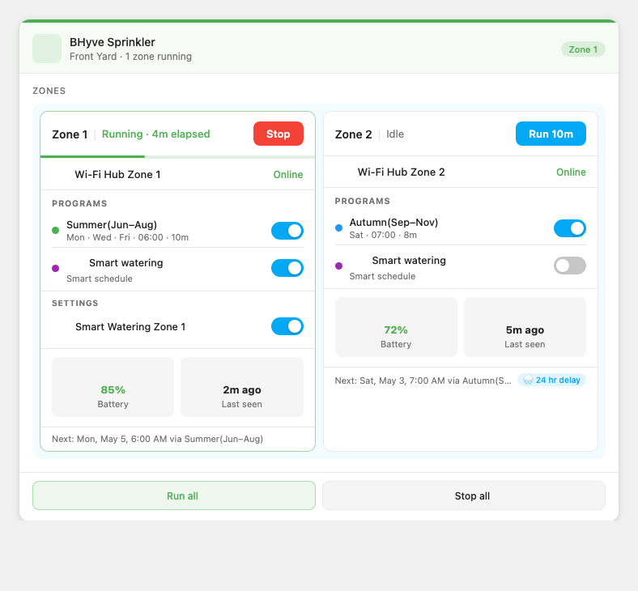
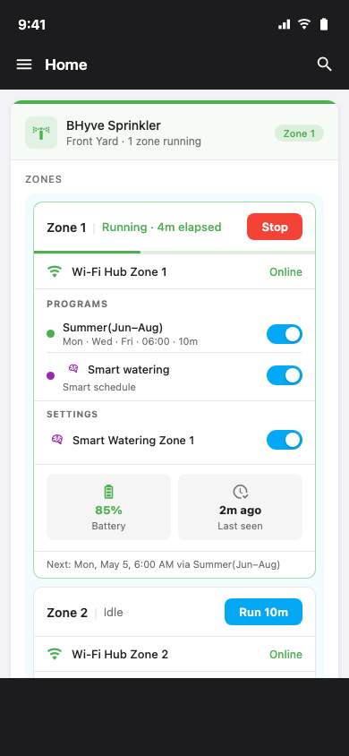

# BHyve Sprinkler Card

A custom Lovelace card for [Orbit BHyve](https://bhyve.orbitonline.com/) smart sprinkler systems in Home Assistant, built specifically for the [sebr/bhyve-home-assistant](https://github.com/sebr/bhyve-home-assistant) integration.



*Left: Zone 1 running with all sections visible — Programs with on/off toggles, Settings with Smart Watering toggle, Health chips, and next-run footer. Zone 2 idle with rain delay pill. Right panel: HA Companion App view.*



---

## Features

- **Self-contained zone cards** — each zone has its own header (`Name | Status` + Run/Stop button), Wi-Fi hub row, Programs list with toggles, Settings section, health chips, and next-run footer
- **Program-aware next run** — reads `program_a/b/c/e` start times and frequency directly from zone switch attributes; calculates the exact next scheduled run across all enabled programs, including the "all runs passed today → next week" case
- **Smart watering toggle** — point `smart_watering_entity` at the zone's smart watering switch (e.g. `switch.timer_zone_1_inside_smart_watering`) to get a live on/off toggle in the Settings section
- **Programs with on/off toggles** — configure `program_entities` per zone to enable real-time program switching; falls back to read-only display from zone switch attributes when not set
- **Per-zone everything** — Wi-Fi hub, battery, health chips, rain delay, schedule, smart watering, and programs are all configured independently per zone with card-level schedule fallbacks
- **Uses BHyve services** — `bhyve.start_watering`, `bhyve.stop_watering` called automatically; falls back to generic HA services
- **Smart status badge** — header shows running zone name, "N zones running", "Rain delay", or "All idle"
- **Optimistic UI** — all toggles and Run/Stop update instantly before HA confirms; handles `switch` and `valve` domains
- **1 or 2-column layout** — configurable per card
- **Fully UI-configurable** — every setting in the visual editor; no YAML required
- **Zero dependencies** — single vanilla-JS file, no NPM, no bundler, no HACS front-end dependencies

---

## Requirements

- Home Assistant 2023.1 or later
- [sebr/bhyve-home-assistant](https://github.com/sebr/bhyve-home-assistant) integration

---

## Installation

### HACS (recommended)

1. Go to **HACS → Frontend → ⋮ → Custom repositories**.
2. Add `https://github.com/reypm/Orbit-BHyve-Custom-Card` as a **Lovelace** repository.
3. Install **BHyve Sprinkler Card** and reload the browser.

### Manual

1. Download `bhyve-sprinkler-card.js` from this repository.
2. Copy it to `<config>/www/community/bhyve-sprinkler-card/bhyve-sprinkler-card.js`.
3. Go to **Settings → Dashboards → Resources** and add:
   - **URL:** `/local/community/bhyve-sprinkler-card/bhyve-sprinkler-card.js`
   - **Resource type:** JavaScript module
4. Reload the browser.

---

## Zone card layout

Each zone card contains these sections in order:

| Section | What it shows |
|---|---|
| **Header** | `Zone name \| Status` on the left, Run/Stop toggle button on the right |
| **Timer bar** | 3 px progress bar (visible while running) |
| **Wi-Fi hub** | Hub entity name + Online/Offline state (when `hub_entity` is set) |
| **Programs** | List of watering programs with on/off pill toggles and schedule details |
| **Settings** | Smart watering entity toggle (when `smart_watering_entity` is set) |
| **Health** | Battery % (colour-coded) and Last seen chips (when `battery_entity` is set) |
| **Footer** | Next scheduled run date/time with program name + rain delay pill |

---

## Configuration

All settings are available through the built-in visual editor. The YAML equivalent is shown below for reference.

```yaml
type: custom:bhyve-sprinkler-card
title: BHyve Sprinkler        # default: "BHyve Sprinkler"
controller_name: Front Yard   # default: "Smart Controller"
columns: 1                    # 1 or 2 column zone grid, default: 2

# Card-level schedule fallback (used when a zone has no per-zone schedule set)
schedule_days: [2]            # 0=Sun … 6=Sat
schedule_time: '06:00'

zones:
  - entity: switch.timer_zone_1_inside    # switch or valve domain
    name: Timer Zone 1
    run_time: 10                           # minutes per zone
    hub_entity: binary_sensor.timer_zone_1_inside_connected
    battery_entity: sensor.timer_zone_1_inside_battery_level
    program_entities:                      # optional — enables on/off toggles
      - switch.timer_zone_1_inside_program_a
      - switch.timer_zone_1_inside_program_e
    smart_watering_entity: switch.timer_zone_1_inside_smart_watering
    schedule_days: [2]                     # overrides card-level fallback
    schedule_time: '04:15'
    rain_delay_entity: binary_sensor.timer_zone_1_inside_rain_delay
    show_sprinkler_type: true
    show_programs: true

  - entity: switch.timer_zone_2_outside
    name: Timer Zone 2
    run_time: 10
    hub_entity: binary_sensor.timer_zone_2_outside_connected
    battery_entity: sensor.timer_zone_2_outside_battery_level
    program_entities:
      - switch.timer_zone_2_outside_program_a
    smart_watering_entity: switch.timer_zone_2_outside_smart_watering
    schedule_days: [2]
    schedule_time: '02:30'
    rain_delay_entity: binary_sensor.timer_zone_2_outside_rain_delay
```

### Card-level fields

| Field | Description |
|---|---|
| `title` | Card title (default: `"BHyve Sprinkler"`) |
| `controller_name` | Subtitle shown below the title (default: `"Smart Controller"`) |
| `columns` | `1` or `2` column zone grid (default: `2`) |
| `schedule_days` | Fallback watering days `[0..6]` used when a zone has no per-zone schedule |
| `schedule_time` | Fallback start time `HH:MM` used when a zone has no per-zone schedule (default: `'06:00'`) |
| `show_actions` | Show/hide the Run all / Stop all action bar (default: `true`) |

### Per-zone fields

| Field | Description |
|---|---|
| `entity` | Zone switch or valve entity (`switch.*` or `valve.*`) |
| `name` | Display name |
| `run_time` | Minutes to run when tapping Run or Run all |
| `hub_entity` | Entity reporting hub online/offline status — shows Wi-Fi hub row |
| `battery_entity` | Battery level sensor — shows colour-coded health chip |
| `program_entities` | Program switch entities — enables on/off toggles per program |
| `smart_watering_entity` | Smart watering switch entity — shows a live toggle in the Settings section |
| `schedule_days` | Watering days `[0..6]` (overrides card-level fallback) |
| `schedule_time` | Start time `HH:MM` (overrides card-level fallback) |
| `rain_delay_entity` | Rain delay switch/binary sensor — shows pill in zone footer |
| `show_sprinkler_type` | Show/hide sprinkler type badge (default `true`) |
| `show_programs` | Show/hide programs section (default `true`) |

### How next run is calculated

The card reads program schedules in this priority order:

1. **`program_entities`** — enabled programs (`state: on`) only; reads `frequency.days` and `start_times` from each switch entity's attributes
2. **`program_a/b/c/e` zone attributes** — read-only fallback from the zone switch itself when no program entities are configured
3. **`schedule_days` + `schedule_time`** — per-zone value, or card-level fallback when no per-zone schedule is set

For each program it finds the earliest future start time across all configured times. If today is a scheduled watering day but all start times have already passed, the next run advances to the same weekday next week.

The footer shows: `Next: Tue, Apr 28, 4:15 AM via Summer(Jun-Aug)`

### Programs (automatic fallback)

When `program_entities` is not set, the card reads `program_a`, `program_b`, `program_c`, and `program_e` directly from the zone switch attributes and displays them read-only with schedule details. `program_e` and any entry with `is_smart_program: true` show a brain icon and purple dot.

---

## Action buttons

| Button | Service called |
|---|---|
| **Run** (per zone) | `bhyve.start_watering` → falls back to `valve.open_valve` / `homeassistant.turn_on` |
| **Stop** (per zone) | `bhyve.stop_watering` → falls back to `valve.close_valve` / `homeassistant.turn_off` |
| **Program toggle** | `homeassistant.turn_on` / `turn_off` on the program switch entity |
| **Smart watering toggle** | `homeassistant.turn_on` / `turn_off` on the smart watering switch entity |
| **Run all** | Run logic applied to every zone in sequence |
| **Stop all** | Stop logic applied to every zone |

---

## Troubleshooting

**Card not appearing** — hard-refresh the browser (Ctrl/Cmd+Shift+R) and confirm the resource is registered under Settings → Dashboards → Resources.

**Zone stays Idle after tapping Run** — the card uses optimistic state; if it snaps back immediately check the HA logs for `bhyve.start_watering` errors and confirm the entity ID is correct.

**Programs not showing** — programs are read from `program_a/b/c/e` attributes on the zone switch. If those attributes are missing, check your bhyve integration version. Alternatively configure `program_entities` in the zone to point to the program switch entities directly.

**Smart watering toggle not appearing** — set `smart_watering_entity` to the switch entity for this zone (e.g. `switch.timer_zone_1_inside_smart_watering`). The Settings section is only shown when this field is configured.

**Hub shows Offline unexpectedly** — the hub row maps `on/home/connected/online` → Online and `off/away/disconnected/offline/unavailable` → Offline. Any other state string is shown as-is.

**Rain delay pill not showing** — confirm `rain_delay_entity` is set per-zone and that the entity state is `on`. The pill appears in the zone footer when the entity is active, and shows `hours_remaining` from the entity's attributes when available.

**Next run not calculating** — configure `program_entities` so the card can read enabled program schedules, or set `schedule_days` and `schedule_time` (per-zone or at card level) as a fallback.

---

## Contributing

```bash
# Syntax check
node --check bhyve-sprinkler-card.js

# Full test suite (no browser needed)
node validate.test.js
```

Run the test suite before opening a PR. Add assertions to `validate.test.js` for any logic you change.

---

## License

MIT © [reypm](https://github.com/reypm)

Built on [sebr/bhyve-home-assistant](https://github.com/sebr/bhyve-home-assistant).
