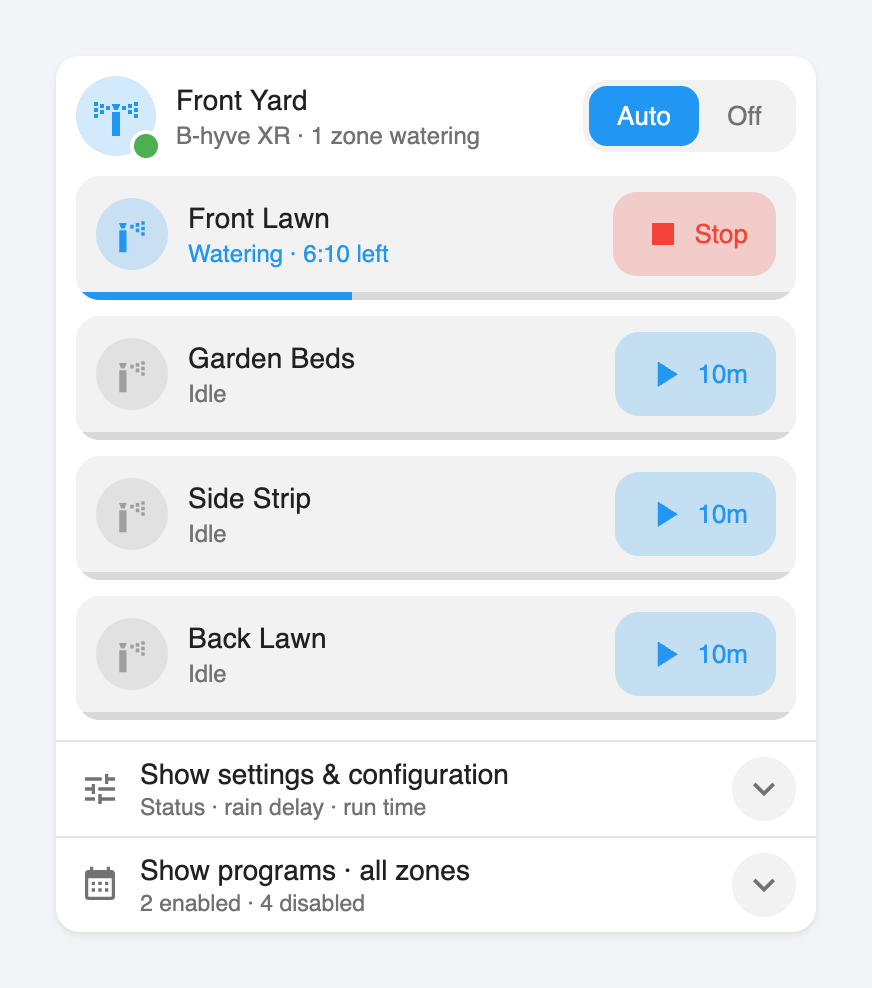
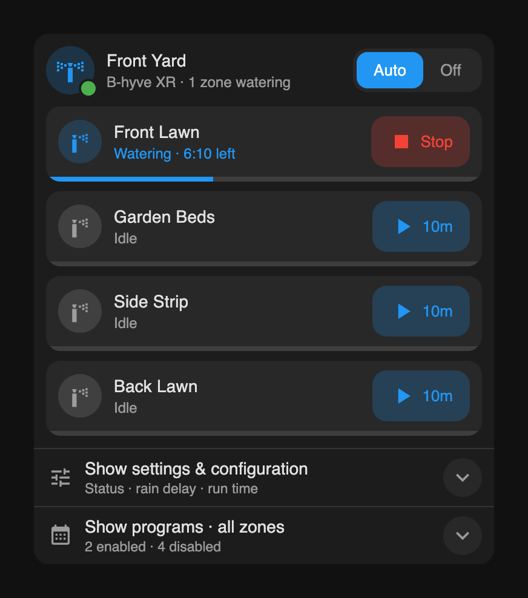
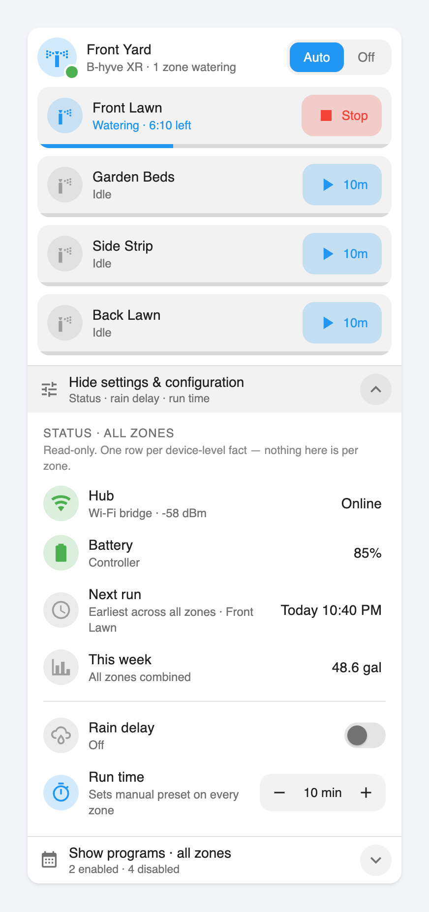
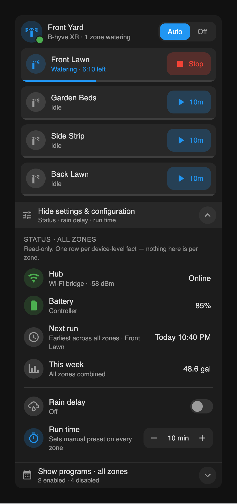
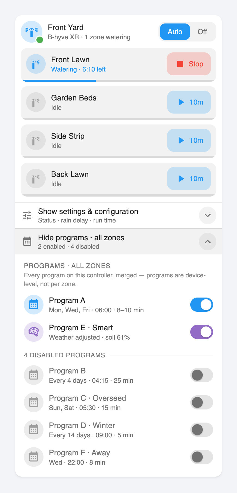
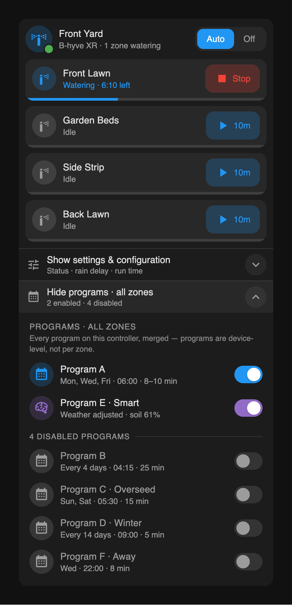
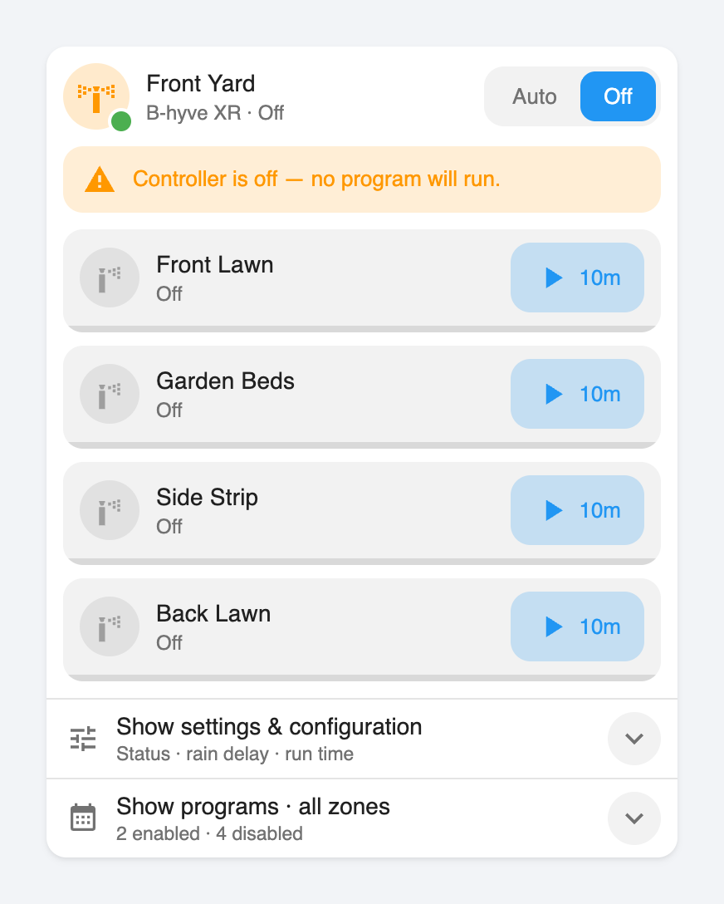
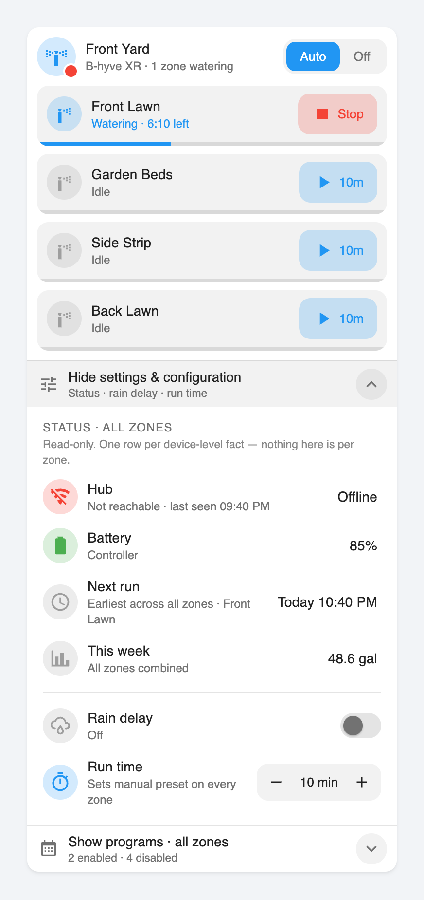

# B-hyve Cards for Home Assistant

[](https://github.com/reypm/Orbit-BHyve-Custom-Card/actions/workflows/test.yml)

One Lovelace card for [Orbit B-hyve](https://bhyve.orbitonline.com/) irrigation systems,
built for the [sebr/bhyve-home-assistant](https://github.com/sebr/bhyve-home-assistant)
integration and styled with the [Mushroom](https://github.com/piitaya/lovelace-mushroom)
design vocabulary.

> ### ⚠️ v5.0.0 is a breaking change
>
> The v3–v4 pair — `custom:bhyve-controller-card` and `custom:bhyve-zone-card` — is now a
> single `custom:bhyve-card`. One card per B-hyve device, with every zone as a row inside
> it instead of a card of its own.
>
> **`custom:bhyve-zone-card` is gone and will not render.** If you have zone cards on a
> dashboard, see [Migrating from v4](#migrating-from-v4) — it is usually a delete, not a
> rewrite. `custom:bhyve-controller-card` still works: it is kept as an alias of the new
> card, so a v4 controller-card config renders unchanged.

| Light | Dark | Mobile |
|---|---|---|
|  |  |  |

---

## Requirements

- Home Assistant 2023.1 or newer
- The [sebr/bhyve-home-assistant](https://github.com/sebr/bhyve-home-assistant) integration
- [Mushroom](https://github.com/piitaya/lovelace-mushroom) — **optional.** The card borrows
  Mushroom's visual vocabulary, but every colour falls back to Mushroom's own default value,
  so it looks the same whether or not it is installed. If you do run a Mushroom theme that
  sets `--mush-rgb-*`, the card picks those overrides up automatically.

---

## Installation

### HACS (recommended)

1. HACS → Frontend → ⋮ → **Custom repositories**
2. Add `https://github.com/reypm/Orbit-BHyve-Custom-Card` as a **Lovelace** repository
3. Install **B-hyve Cards**, then hard-refresh the browser

### Manual

Copy `bhyve-cards.js` to `config/www/` and register it once:

```yaml
# Settings → Dashboards → Resources
url: /local/bhyve-cards.js
type: module
```

---

## Quick start

Zero config. The card discovers the device, its zones and every related entity from the
device and entity registries.

```yaml
type: custom:bhyve-card
```

That is the whole configuration for a single-controller setup. With more than one B-hyve
device, add one card per device and name it:

```yaml
type: custom:bhyve-card
device_id: 0a1b2c3d4e5f…
```

---

## The card

Top to bottom — every element below is visible in the screenshots in this section.

| Collapsed | Collapsed · dark |
|---|---|
|  |  |

### Header

Device name, model and the aggregate state of every zone (`All idle` / `1 zone watering` /
`Rain delay active` / `Fault detected` / `Off`), plus an **Auto/Off segmented control**.
This is the authoritative device-mode control; it calls `select.select_option` on
`select.*_device_mode`.

The device icon carries a small **hub-status dot** at its bottom-right corner — green when
`binary_sensor.*_connected` is on, red when it is not. It is easy to miss in a static
screenshot and easy to rely on once you know it is there: an offline hub is the one fact
that explains every other stale value on the card, so it is the only thing that is always
visible. **No configuration option can hide it**, and it renders whether the sections
below are open or closed.

There is deliberately no second dot. The moment there are two, neither reads as a status
light.

### Zone rows

One compact row per zone: shape icon, name, `Idle` or `Watering · M:SS left` recomputed
live from `started_watering_station_at`, and a single Run/Stop button carrying the current
preset duration. Tapping the name opens Home Assistant's standard more-info dialog.

Rows follow the controller's own station numbering, not entity-id order.

### Settings & configuration

The first of two collapsible sections, closed by default. Its sub-line reads
`Status · rain delay · run time`, so you know what is inside without opening it.

| Open | Open · dark |
|---|---|
|  |  |

**STATUS · ALL ZONES** comes first: four **read-only** rows, one per device-level fact.
Nothing here is per zone, and nothing here is a control — the right-hand column is a value,
never a switch.

| Row | Shows |
|---|---|
| **Hub** | `Online` / `Offline`. Sub-line names the bridge and its signal strength when a signal sensor resolves; when offline it reads `Not reachable · last seen HH:MM` instead |
| **Battery** | The controller's battery percentage, amber below 20% |
| **Next run** | The earliest scheduled run across every zone, naming the zone that owns it |
| **This week** | Total water volume, all zones combined — see [Weekly volume](#weekly-volume) |

A row is omitted individually when the entity behind it does not resolve, so nothing is
faked: the Hub sub-line drops the signal reading when no signal sensor exists, and the
Battery sub-line claims no charging state, which the integration does not expose.

Below a divider sit the two things you can act on:

- **Rain delay** — a toggle, with hours remaining and cause while active.
- **Run time** — a stepper that writes the manual preset to every zone on the controller
  via `bhyve.set_manual_preset_runtime`.

### Programs · all zones

The second section, also closed by default. Its sub-line counts both halves —
`2 enabled · 4 disabled`.

| Open | Open · dark |
|---|---|
|  |  |

Every `switch.*_*_program` on the device, merged and listed once with its schedule.
Programs are **device-level, not per zone**, so this list is not filtered by zone and there
is no zone selector.

Enabled programs list first. Disabled ones follow below an `N disabled programs` rule, as a
subsection rather than a second fold — this is the place you come to configure programs, so
hiding half of them behind another tap inside a section you already opened would be one
fold too many. Their switches are live either way; only the name steps back in colour.

A weather-adjusted (smart) program reads `Weather adjusted · soil 61%` rather than a fixed
schedule, because it picks its own start times and durations.

Programs here are **independent switches** — enabling one does not disable another.

### The two sections are independent

Each has its own chevron and its own open state; either, both or neither can be open. Both
start closed, so the card rests at header + zone rows + two toggle rows.

### The Off state

Switching the device to **Off** swaps the status for an orange banner, since no program
will run until it goes back to Auto. This is device-level: it affects every zone at once.



### An offline hub

The dot turns red and the Hub row says when the device was last reachable. Every other
value on the card is the last one received.



---

## Configuration

### Card fields

| Field | Type | Default | Notes |
|---|---|---|---|
| `title` | string | device name | Header title |
| `device_id` | string | first B-hyve device | From the device registry |
| `zones` | list | discovered | Entity ids, or `{ entity, name }` — see below |
| `entity` | string | — | Point at a flood sensor to render the [flood layout](#flood-sensors) |
| `run_time` | number | `10` | Starting value for the run-time stepper |
| `rain_delay_hours` | number | `24` | Hours passed to `bhyve.enable_rain_delay` |
| `show_actions` | bool | `true` | Run/Stop, rain delay, run time and the programs section. Never the Status rows |
| `show_programs` | bool | `true` | The programs section alone. Never the Status rows |

### Entity overrides

Every one of these is discovered. Set one only where discovery guesses wrong.

| Field | Type | Discovers |
|---|---|---|
| `device_mode_entity` | string | `select.*_device_mode` |
| `hub_entity` | string | `binary_sensor.*_connected` — backs the hub dot and the Hub row |
| `signal_entity` | string | `sensor.*_signal_strength` — appended to the Hub row when present |
| `battery_entity` | string | `sensor.*_battery_level` |
| `next_watering_entity` | string | `sensor.*_next_watering` |
| `rain_delay_entity` | string | `switch.*_rain_delay` |
| `fault_entity` | string | `binary_sensor.*_fault` |
| `program_entities` | list | `switch.*_*_program` |
| `weekly_volume_entity` | string or list | Nothing — see [Weekly volume](#weekly-volume) |
| `temperature_entity` | string | `sensor.*_temperature` (flood sensors) |

### Zones

Left unset, the card lists every `valve.*` on the device in station order. Set `zones` to
restrict or reorder them. Both forms work, and they mix:

```yaml
zones:
  - valve.front_lawn                 # entity id
  - entity: valve.garden_beds        # with a display-name override
    name: Beds
```

The object form exists because renaming a zone was the one per-zone setting the old zone
card had that v5b still renders. Everything else about a zone comes from its entity.

### Weekly volume

The integration only exposes the **latest** run per zone, so a weekly total has to come
from a Home Assistant statistics helper you create yourself — sum `consumption_gallons`
over a week — and then point `weekly_volume_entity` at it. The card accepts either form:

```yaml
# one device-level helper — the whole controller's total
weekly_volume_entity: sensor.front_yard_weekly_gallons

# one helper per zone — the card sums them
weekly_volume_entity:
  - sensor.front_lawn_weekly_gallons
  - sensor.garden_beds_weekly_gallons
```

Given a list, the row sums only the helpers that actually report; unavailable ones are
skipped rather than counted as zero. If the list covers fewer helpers than the card has
zones, the sub-line reads `2 of 4 zones` instead of `All zones combined`, so a partial
total never passes itself off as the whole. A single helper is a whole-controller total by
definition and is always labelled as such. The row is omitted when the total is zero or
nothing is configured.

### Run time, and what happens when the device says no

The stepper calls `bhyve.set_manual_preset_runtime` on every zone valve, so the value
survives reloads and matches the B-hyve app. Support for that service is patchy across
devices. If the call is rejected — or the service is not available at all — the card keeps
the value as a **session-only default for itself**, does not persist it across reloads, and
shows an inline note saying the device refused the preset. Watering works either way: the
Run button always passes its own explicit `minutes`.

### Flood sensors

A B-hyve flood sensor is its own device with none of a controller's parts, so pointing the
card at one renders the flood layout instead: a home icon (blue when dry, red when wet),
`Dry` or `Water detected · HH:MM`, and chips for temperature, signal strength and battery.

```yaml
type: custom:bhyve-card
entity: binary_sensor.basement_flood_sensor
```


### Visual editor

The card has one. It offers title, device picker (filtered to the B-hyve integration), run
time and the two `show_*` toggles. The entity overrides and `zones` are YAML-only for now —
the editor notes this inline.

---

## Migrating from v4

v4 shipped two card types. v5 has one.

**Controller cards keep working.** `custom:bhyve-controller-card` is registered as an alias
of `custom:bhyve-card` with the same config, so nothing breaks on upgrade. Switch the type
when convenient:

```yaml
# v4                                  # v5
type: custom:bhyve-controller-card     type: custom:bhyve-card
show_actions: true                     show_actions: true
show_programs: true                    show_programs: true
```

**Zone cards must go.** `custom:bhyve-zone-card` is not registered any more and will render
as a missing custom element. Delete them: everything a zone card showed is either on the
merged card already or was per-zone duplication of a device-level fact, which is what v5
exists to remove.

**Before (v4):**

```yaml
- type: custom:bhyve-controller-card
- type: custom:bhyve-zone-card
  entity: valve.front_lawn
- type: custom:bhyve-zone-card
  entity: valve.garden_beds
```

**After (v5):**

```yaml
- type: custom:bhyve-card
```

What happened to each zone-card option:

| v4 zone card | v5 |
|---|---|
| `entity` | Gone. Zones are rows on the one card; use `zones` to restrict which ones |
| `name` | `zones: [{ entity: …, name: … }]` |
| `run_time` | `run_time` on the card, applied to every zone |
| `show_actions` | `show_actions` on the card |
| `show_smart_watering_and_programs` | Gone. The card's programs section is device-level; `show_programs` hides it |
| `hub_entity`, `battery_entity`, `fault_entity`, `rain_delay_entity`, `next_watering_entity`, `program_entities`, `weekly_volume_entity`, `signal_entity`, `temperature_entity`, `rain_delay_hours` | Same names, on the one card |
| `history_entity`, `smart_watering_entity` | Gone. Nothing on the merged card renders per-zone run history or per-zone smart watering |

A flood-sensor zone card becomes a `bhyve-card` with the same `entity` — that layout moved
across unchanged.

Migrating from **v2**? Its single `bhyve-sprinkler-card` was removed in v3; pin the
[`v2.0.0`](https://github.com/reypm/Orbit-BHyve-Custom-Card/releases/tag/v2.0.0) tag if you
still need it.

---

## Troubleshooting

**Card not appearing** — hard-refresh (Ctrl/Cmd+Shift+R) and confirm `bhyve-cards.js` is
registered under Settings → Dashboards → Resources.

**"Custom element doesn't exist: bhyve-zone-card"** — expected on v5. Delete the zone card;
see [Migrating from v4](#migrating-from-v4).

**"No B-hyve devices found"** — the card could not find a B-hyve device in the registry.
Confirm the integration is loaded, then set `device_id` explicitly. Discovery reads the
registry once per page load; reload after adding devices.


**A zone stays Idle after tapping Run** — the card uses optimistic state. If it snaps back,
check the HA log for `bhyve.start_watering` errors and confirm the entity is the zone valve.

**A Status row is missing** — each row is omitted when the entity behind it does not
resolve. Hub and Battery need `binary_sensor.*_connected` and `sensor.*_battery_level` on
the device; Next run needs either `sensor.*_next_watering` or a zone with a future
`next_start_time`; This week needs `weekly_volume_entity`. Neither `show_actions: false`
nor `show_programs: false` can remove the section — they hide controls, not device health.

**Hub shows Offline unexpectedly** — the Hub row reads the device's own
`binary_sensor.*_connected`. Set `hub_entity` if discovery picked the wrong one.

**Programs missing or wrong** — the section lists every `switch.*_*_program` on the device,
merged. If one is missing, set `program_entities` explicitly.

**The run-time stepper doesn't stick** — the integration reads `manual_preset_runtime` once
when it builds the valve entity and never refreshes it, so a successful
`bhyve.set_manual_preset_runtime` is not reflected in the attribute until the integration
reloads. Tracked upstream:
[sebr/bhyve-home-assistant#478](https://github.com/sebr/bhyve-home-assistant/issues/478).
If the device rejects the call outright, the card says so beneath the stepper and keeps the
value locally for this session.

**Colours don't match my Mushroom theme** — the card reads `--mush-rgb-*` from the document,
which only has a value if your theme sets one. Mushroom does not set these itself; it only
reads them. Without an override the card uses Mushroom's own default palette, which is the
intended look.

---

## Contributing

```bash
node --check bhyve-cards.js
node validate.test.js
```

`tools/harness.html` renders the card in a browser against a mocked Home Assistant — real
HA theme variables, real MDI icon paths, and stand-ins for `ha-card` / `ha-icon`. Open it
directly (`file://…/tools/harness.html?mush=design`) or screenshot it headless:

```bash
"/Applications/Google Chrome.app/Contents/MacOS/Google Chrome" \
  --headless=new --window-size=900,4300 --force-device-scale-factor=2 \
  --screenshot=gallery.png "file://$PWD/tools/harness.html?mush=design"
```

Query parameters: `state=<substring>` renders one state, `w=<px>` sets the card width (for
checking text overflow), `mush=design|teal|none` controls the `--mush-rgb-*` override, and
`compose=<recipe>` renders one of the README images. In compose mode the page title
becomes `H<height>` once laid out, so a capture script can size the window to the content.

**Every image in `docs/` is a headless render of the shipped `bhyve-cards.js` through that
harness — never an export from the design canvas.** The README documents what ships.

Read [DESIGN_DECISIONS.md](DESIGN_DECISIONS.md) before changing anything visual.

`validate.test.js` is headless — it stubs the browser globals it needs and evaluates the
card file, then renders the card against a fake device/entity registry and dispatches real
clicks at the rendered handles. Run it before opening a PR, and add assertions for any
logic you change.

### Why one file

The card, its editor and all shared logic ship in a single `bhyve-cards.js`: one Lovelace
resource to register, no load-order problem, no build step. The filename is plural for
historical reasons — it shipped two card types from v3 to v4 — and is kept so existing
HACS installs and resource registrations keep working.

---

## License

MIT © [reypm](https://github.com/reypm)

Built on [sebr/bhyve-home-assistant](https://github.com/sebr/bhyve-home-assistant).
Design vocabulary from [Mushroom](https://github.com/piitaya/lovelace-mushroom).
