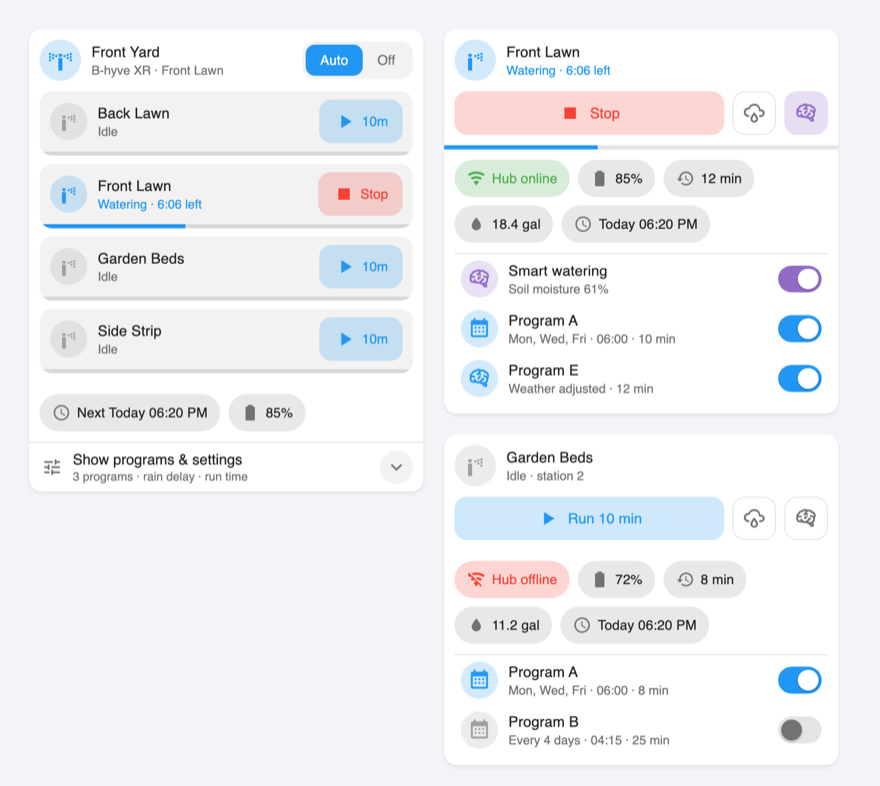
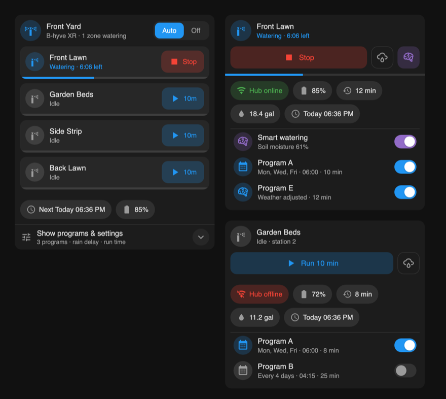
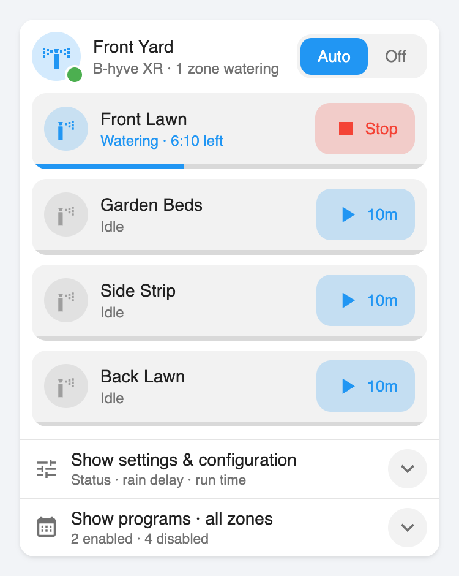
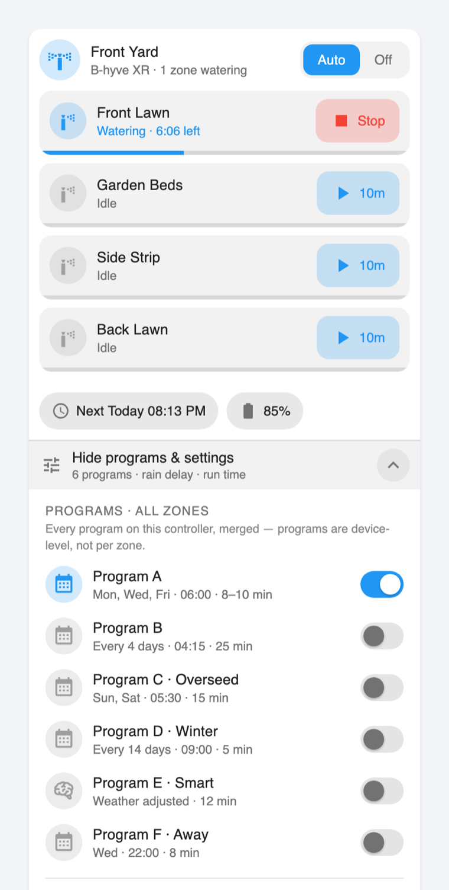
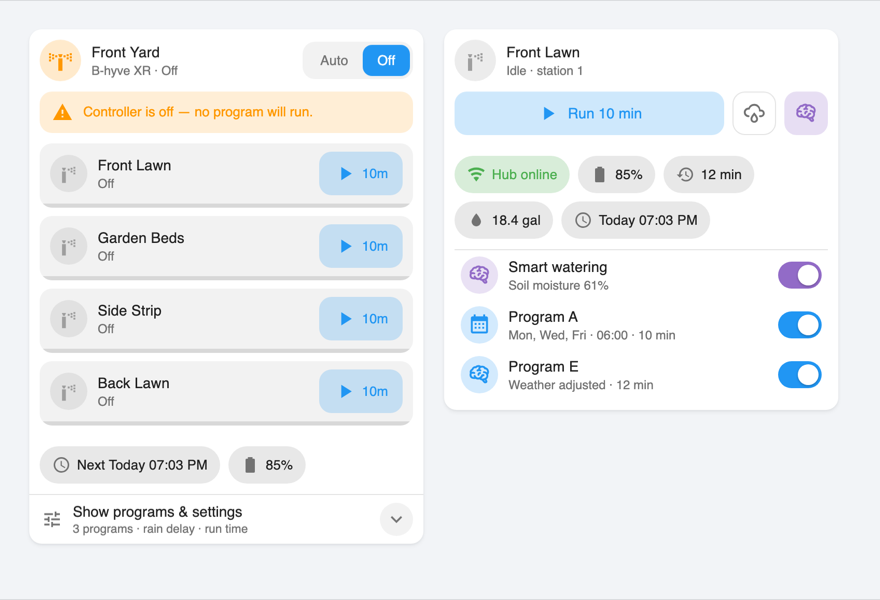
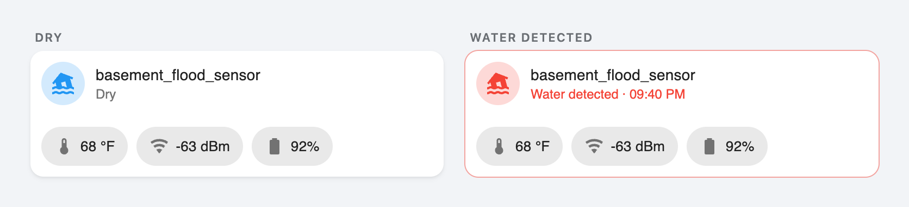
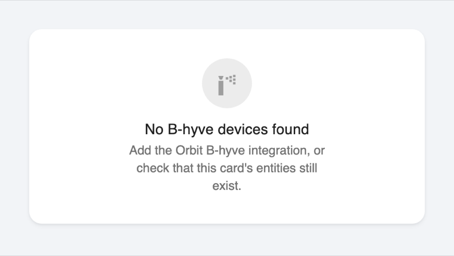

# B-hyve Cards for Home Assistant

[](https://github.com/reypm/Orbit-BHyve-Custom-Card/actions/workflows/test.yml)

Two Lovelace cards for [Orbit B-hyve](https://bhyve.orbitonline.com/) irrigation systems,
built for the [sebr/bhyve-home-assistant](https://github.com/sebr/bhyve-home-assistant)
integration and styled with the [Mushroom](https://github.com/piitaya/lovelace-mushroom)
design vocabulary.

| Card | Type | One per | What it is for |
|---|---|---|---|
| **Controller card** | `custom:bhyve-controller-card` | B-hyve device | Device overview — status, Auto/Off, a compact row per zone, and the settings all zones share (programs, rain delay, run time). |
| **Zone card** | `custom:bhyve-zone-card` | zone | Full detail for one zone — state, controls, the complete chip row, smart watering and that zone's programs. Also renders B-hyve flood sensors. |

The two are independent. A zone row on the controller card is **not** a collapsed zone
card and never expands into one — tapping it opens Home Assistant's standard more-info
dialog. Place zone cards wherever you want them on the dashboard; you do not need the
controller card to use them, or vice versa.

> **v3 is a breaking change.** The single `bhyve-sprinkler-card` is gone.
> See [Migrating from v2](#migrating-from-v2).

| Light | Dark | Mobile |
|---|---|---|
|  |  |  |

---

## Requirements

- Home Assistant 2023.1 or newer
- The [sebr/bhyve-home-assistant](https://github.com/sebr/bhyve-home-assistant) integration
- [Mushroom](https://github.com/piitaya/lovelace-mushroom) — **optional.** The cards borrow
  Mushroom's visual vocabulary, but every colour falls back to Mushroom's own default value,
  so they look the same whether or not it is installed. If you do run a Mushroom theme that
  sets `--mush-rgb-*`, the cards pick those overrides up automatically.

---

## Installation

### HACS (recommended)

1. HACS → Frontend → ⋮ → **Custom repositories**
2. Add `https://github.com/reypm/Orbit-BHyve-Custom-Card` as a **Lovelace** repository
3. Install **B-hyve Cards**, then hard-refresh the browser

### Manual

Copy `bhyve-cards.js` to `config/www/` and register it once:

```yaml
# Settings → Dashboards → Resources
url: /local/bhyve-cards.js
type: module
```

### Why one file

Both card types ship in a single `bhyve-cards.js`. They share a lot — registry
discovery, formatting, optimistic state, the service-call wrappers — and the two obvious
alternatives are each worse:

- **A shared module plus two thin card files** means three Lovelace resources whose load
  order matters. HACS's `filename` field names one file anyway, so the extra files would
  need manual registration in the right sequence.
- **Duplicating the shared code into two self-contained files** removes the ordering
  problem but guarantees the two copies drift apart.

One file keeps a single source of truth, one resource to register, and no build step. The
cost is that you load both cards even if you only use one — about 60 KB, once, cached.

---

## Quick start

Zero config. Both cards discover everything from the device and entity registries.

```yaml
type: custom:bhyve-controller-card
```

```yaml
type: custom:bhyve-zone-card
entity: valve.front_lawn
```

---

## Controller card

```yaml
type: custom:bhyve-controller-card
title: Front Yard          # optional — defaults to the device name
device_id: abc123…         # optional — defaults to the first B-hyve device found
show_actions: true         # optional — default true
show_programs: true        # optional — default true
```



Top to bottom — every element below is visible in the screenshot, which has the drawer
expanded:

- **Header** — device name, model and live status (`Front Lawn` / `2 zones running` /
  `Rain delay active` / `All idle` / `Fault detected` / `Off`), plus an **Auto/Off
  segmented control**. This is the authoritative device-mode control; it calls
  `select.select_option` on `select.*_device_mode`.
- **Zone rows** — one compact, permanently-collapsed row per zone: shape icon, name,
  `Idle` or `Watering · M:SS left`, and a single Run/Stop button. Tapping the name opens
  the more-info dialog.
- **Summary chips** — next scheduled run, battery, and an optional weekly-gallons chip.
- **Programs & settings drawer** — closed by default, opened by the handle row:
  - **Programs · all zones** — every `switch.*_*_program` on the device, merged and listed
    once with its schedule. Programs are device-level, not per zone, so this list is not
    filtered by zone and there is no zone selector.
  - **Rain delay** — toggle, with hours remaining and cause while active.
  - **Run time** — a stepper that writes the manual preset to every zone on the controller
    via `bhyve.set_manual_preset_runtime`.

`show_actions: false` hides the Run/Stop buttons and the drawer, giving a read-only
overview. The Auto/Off control stays.

`show_programs: false` drops the drawer on its own — the merged program list, the rain
delay row, the run time stepper, and the show/hide row that opens them — while leaving the
Run/Stop buttons in place. Use it when the programs live on one dashboard card and you want
the others to stay compact. The section is not rendered at all, not hidden with CSS, so
there is nothing left to expand. Setting either option to `false` is enough to remove the
drawer.

### The Off state

Switching the device to **Off** swaps the status for an orange banner, since no program
will run until it goes back to Auto. This is a device-level state: it affects every zone
on the controller at once.



### Controller card fields

| Field | Type | Default | Notes |
|---|---|---|---|
| `title` | string | device name | Header title |
| `device_id` | string | first B-hyve device | From the device registry |
| `show_actions` | bool | `true` | Run/Stop buttons and the drawer |
| `show_programs` | bool | `true` | Set `false` to omit the whole programs & settings drawer, its show/hide row included |
| `run_time` | number | `10` | Starting value for the run-time stepper |
| `zones` | list | discovered | Explicit list of zone valve entities |
| `device_mode_entity` | string | discovered | `select.*_device_mode` |
| `rain_delay_entity` | string | discovered | `switch.*_rain_delay` |
| `next_watering_entity` | string | discovered | `sensor.*_next_watering` |
| `battery_entity` | string | discovered | `sensor.*_battery_level` |
| `fault_entity` | string | discovered | `binary_sensor.*_fault` |
| `program_entities` | list | discovered | `switch.*_*_program` |
| `weekly_volume_entity` | string | — | See [Weekly volume](#weekly-volume) |
| `rain_delay_hours` | number | `24` | Hours passed to `bhyve.enable_rain_delay` |

### Run time, and what happens when the device says no

The stepper calls `bhyve.set_manual_preset_runtime` on every zone valve, so the value
survives reloads and matches the B-hyve app. Support for that service is patchy across
devices. If the call is rejected — or the service is not available at all — the card keeps
the value as a **session-only default for itself**, does not persist it across reloads,
and shows an inline note saying the device refused the preset.

This value is never used by the zone card's Run button, which always passes its own
explicit `minutes`. Watering works either way.

---

## Zone card

```yaml
type: custom:bhyve-zone-card
entity: valve.front_lawn   # required
name: Front Lawn           # optional
run_time: 10               # optional — minutes for the Run button
show_programs: true        # optional — default true
```

Everything else — hub, battery, history, programs, smart watering, rain delay, fault —
is discovered from the zone's own device.

### The four states

| State | Looks like |
|---|---|
| **Idle** | Grey shape icon, `Idle · station N`, a Run button showing the preset minutes, the chip row, and smart watering + this zone's programs rendered inline. |
| **Running** | Accent shape icon, `Watering · M:SS left` recomputed live from `started_watering_station_at`, a Stop button, a thin progress bar, the same chip row, and quick-action buttons for rain delay and smart watering (filled when on, hairline outline when off). |
| **Fault** | Red card border and icon, `Fault · will not run`, an inline warning banner with the human-readable fault from `station_faults`, and a disabled **Run blocked** button. The chip row is still shown. |
| **Unavailable** | `?` icon, `Unavailable · entity not reporting`, only the hub and `Last seen …` chips, and **no action button at all**. |

All four, in the same order as the table above — each panel is labelled with its state:


> **There is a fifth thing to look for.** When the controller's device mode is **Off**,
> no zone will run even though each one still reports `Idle`. That state lives on the
> controller card, not the zone card — see [The Off state](#the-off-state) and
> [`docs/zone-card-off.png`](docs/zone-card-off.png).

The zone card has no expander. Smart watering and program rows render directly; set
`show_programs: false` to leave them out of the card altogether.

### The chip row

Fixed order, not configurable. Each chip has its own visibility rule.

| # | Chip | Shown when |
|---|---|---|
| 1 | **Hub status** | Always, from this zone's own `binary_sensor.*_connected`. Green online, red offline — never hidden, because an offline hub explains every other stale chip. |
| 2 | **Battery %** | The battery sensor exists. Amber with a battery-alert icon at ≤ 20%; neutral otherwise. Absent on mains-powered controllers. |
| 3 | **Last-run duration** | The zone history sensor exists *and* the zone has run at least once. |
| 4 | **Last-run volume** | Same history entry as #3 — the two appear and disappear together. |
| 5 | **Weekly volume** | Optional, and only when the value is a real number greater than zero. |
| 6 | **Next run / rain delay** | One slot. Shows the next scheduled time normally; while a rain delay is active, the delay chip replaces it, tinted with the accent. |

Hub connectivity is resolved **per zone**, not shared from the controller. That was a bug
in v2 and is fixed here.

### Zone card fields

| Field | Type | Default | Notes |
|---|---|---|---|
| `entity` | string | **required** | The zone valve, or a flood-sensor `binary_sensor` |
| `name` | string | zone name | Display name |
| `run_time` | number | `10` | Minutes for the Run button |
| `show_programs` | bool | `true` | Set `false` to omit the smart-watering row and program list entirely |
| `hub_entity` | string | discovered | `binary_sensor.*_connected` |
| `battery_entity` | string | discovered | `sensor.*_battery_level` |
| `history_entity` | string | discovered | `sensor.*_zone_history` |
| `fault_entity` | string | discovered | `binary_sensor.*_fault` |
| `rain_delay_entity` | string | discovered | `switch.*_rain_delay` |
| `smart_watering_entity` | string | discovered | `switch.*_smart_watering` |
| `program_entities` | list | discovered | Matched to the zone by `run_times[].station` |
| `next_watering_entity` | string | discovered | `sensor.*_next_watering` |
| `weekly_volume_entity` | string | — | See below |
| `rain_delay_hours` | number | `24` | Hours passed to `bhyve.enable_rain_delay` |

### Weekly volume

The integration only exposes the **latest** run per zone, so a weekly total has to come
from a Home Assistant statistics helper you create yourself — sum
`consumption_gallons` over a week — and then point `weekly_volume_entity` at it.

The chip is omitted entirely when the entity is not configured, unavailable, or zero. A
`0 gal this week` chip is never rendered.

### Flood sensors

Point a zone card at a B-hyve flood sensor's `binary_sensor` and it renders the flood
layout instead: a home icon (blue when dry, red when wet), `Dry` or
`Water detected · HH:MM`, and chips for temperature, signal strength and battery.



---

## Configuration editors

Both cards have visual editors. The controller editor offers title, device picker
(filtered to the B-hyve integration) and the actions toggle; the zone editor offers the
entity picker, name, run time and the **Show smart watering and programs** toggle. Both
cards expose a `show_programs` toggle, worded for what each one actually hides — **Show
programs & settings** on the controller card. The entity overrides in the tables above are
YAML-only for now — the editors note this inline.

---

## Migrating from v2

v2 was a single `bhyve-irrigation-card` / `bhyve-sprinkler-card` with a manually
configured zone grid inside one card. v3 replaces it with two card types placed as
separate dashboard cards, and discovers zones from the registry instead of asking you to
list them.

**Before (v2):**

```yaml
type: custom:bhyve-sprinkler-card
title: BHyve Sprinkler
columns: 2
zones:
  - entity: switch.front_lawn
    name: Front Lawn
    run_time: 10
    battery_entity: sensor.front_lawn_battery_level
  - entity: switch.garden_beds
    name: Garden Beds
    run_time: 10
```

**After (v3):**

```yaml
type: custom:bhyve-controller-card

# then one of these per zone, wherever you want them
type: custom:bhyve-zone-card
entity: valve.front_lawn

type: custom:bhyve-zone-card
entity: valve.garden_beds
```

Notes on the move:

- **Zone entities are `valve.*` in v3.** v2 also accepted `switch.*`; point the new cards
  at the valve entities the integration creates.
- **Drop the per-zone entity lists.** `battery_entity`, `hub_entity`, `program_entities`
  and friends are discovered. Keep them only where discovery guesses wrong.
- **`columns` is gone.** Use a `grid` card if you want zone cards side by side.
- **`schedule_days` / `schedule_time` are gone.** Next run now comes from the zone's
  `next_start_time` and the device's `sensor.*_next_watering`, so there is no manual
  schedule fallback to configure.
- **The v2 card is not shipped any more.** If you want the old single-card layout, pin
  the [`v2.0.0`](https://github.com/reypm/Orbit-BHyve-Custom-Card/releases/tag/v2.0.0)
  git tag and keep using `bhyve-sprinkler-card.js` from there.

---

## Troubleshooting

**Cards not appearing** — hard-refresh (Ctrl/Cmd+Shift+R) and confirm `bhyve-cards.js` is
registered under Settings → Dashboards → Resources.

**"No B-hyve devices found"** — the controller card could not find a B-hyve device in the
registry. Confirm the integration is loaded, then set `device_id` explicitly. Note that
discovery reads the registry once per page load; reload after adding devices.



**Zone stays Idle after tapping Run** *(zone card, controller card)* — the cards use
optimistic state. If it snaps back, check the HA log for `bhyve.start_watering` errors and
confirm the entity is the zone valve.

**The run-time stepper doesn't change the zone cards** *(controller card)* — expected. The
integration reads `manual_preset_runtime` once when it builds the valve entity and never
refreshes it, so a successful `bhyve.set_manual_preset_runtime` is not reflected in the
attribute until the integration reloads. Tracked upstream:
[sebr/bhyve-home-assistant#478](https://github.com/sebr/bhyve-home-assistant/issues/478).
The stepper's own value updates immediately and is used by the controller's rows; zone
cards pick it up after a reload. If the device rejects the call outright the card says so
beneath the stepper and keeps the value locally. Support for that service is patchy — set
`run_time` per zone card if your device does not take it.

**A chip is missing** *(zone card)* — each chip has its own rule; see
[The chip row](#the-chip-row). Last-run chips need the zone to have run at least once, and
the weekly chip needs `weekly_volume_entity` set to a non-zero statistics helper.

**Hub shows Offline unexpectedly** *(zone card)* — the chip reads that zone's own
`binary_sensor.*_connected`. If the zone has no connectivity sensor of its own on a
multi-zone device, the chip is omitted rather than borrowing a sibling zone's — set
`hub_entity` to point at the right one.

**Programs missing or wrong** — the zone card lists only programs whose
`run_times[].station` matches that zone's station; the controller card's drawer lists all
of them, merged. If a program is missing from both, set `program_entities` explicitly.

**Run time stepper snaps back or shows a note** *(controller card)* — the device rejected
`bhyve.set_manual_preset_runtime`. The value is kept for this card until you reload. Zone
card Run buttons are unaffected.

**Colours don't match my Mushroom theme** — the cards read `--mush-rgb-*` from the document,
which only has a value if your theme sets one. Mushroom does not set these itself; it only
reads them. Without an override the cards use Mushroom's own default palette, which is the
intended look.

---

## Contributing

```bash
node --check bhyve-cards.js
node validate.test.js
```

`tools/harness.html` renders both cards in a browser against a mocked Home Assistant —
real HA theme variables, real MDI icon paths, and stand-ins for `ha-card` / `ha-icon`.
Open it directly (`file://…/tools/harness.html?mush=design`) or screenshot it headless:

```bash
"/Applications/Google Chrome.app/Contents/MacOS/Google Chrome" \
  --headless=new --window-size=900,4300 --force-device-scale-factor=2 \
  --screenshot=gallery.png "file://$PWD/tools/harness.html?mush=design"
```

Query parameters: `state=<substring>` renders one state, `w=<px>` sets the card width
(for checking text overflow), `mush=design|teal|none` controls the `--mush-rgb-*`
override, and `preview=1` produces the README image.

Read [DESIGN_DECISIONS.md](DESIGN_DECISIONS.md) before changing anything visual.

`validate.test.js` is headless — it stubs the browser globals it needs and evaluates the
card file, then renders both cards against a fake device/entity registry and dispatches
real clicks at the rendered handles. Run it before opening a PR, and add assertions for
any logic you change.

---

## License

MIT © [reypm](https://github.com/reypm)

Built on [sebr/bhyve-home-assistant](https://github.com/sebr/bhyve-home-assistant).
Design vocabulary from [Mushroom](https://github.com/piitaya/lovelace-mushroom).
